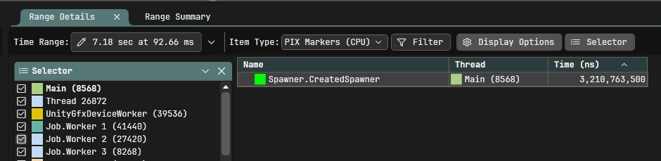

# Muninn: Universal Profiling Marker

## Description

Muninn allows you to instrument code for Unity's profiler, [PIX](https://devblogs.microsoft.com/pix), and [Superluminal](https://superluminal.eu/). PIX and Superluminal are available in release builds as well as in development builds; Unity's profiler is only for development builds. That makes it even more powerful, as you can profile almost fully optimized builds (**Profiler markers are cheap but NOT FREE**).

## Quick installation

In Package Manager, `install package from git URL...`


Paste the git link and click Install.

## Quick start

Add [Assembly Definition References](https://docs.unity3d.com/6000.0/Documentation/Manual/class-AssemblyDefinitionImporter.html). Then you can use:

* `Muninn` static API
* `MuninnMarker` Begin/End
* `MuninnMarker` Auto scope

### Example

```csharp
using KVD.Muninn;
using Unity.Mathematics;
using Unity.Profiling;
using UnityEngine;

public class Test : MonoBehaviour
{
    public float a;
    static readonly MuninnMarker UpdateSinMarker = new MuninnMarker(new Color(0.4f, 0.6f, 0.2f), "Test.UpdateSin");
    static readonly MuninnMarker UpdatePowMarker = new MuninnMarker(ProfilerCategory.Scripts, Color.blue, "Test.UpdatePow");

    void Update()
    {
        Muninn.StartEvent(Color.red, "Test");

        a = 0;
        for (var i = 0; i < 1_000_000; i++)
        {
            UpdateSinMarker.Begin();
            var sin = math.sin(i);
            UpdateSinMarker.End();
            a += math.log2(Pow(i, sin));
        }

        Muninn.EndEvent();

        float Pow(int i, float sin)
        {
            using var _ = UpdatePowMarker.Auto();
            return math.pow(sin, i);
        }
    }
}
```

## Usages

### Events

The most common instrumentation; they have a start and end, so they have a duration as well.

### Marker

Represents a singular and named point in the application. Useful for marking long-running but rare game events, such as the start and end of serialization, boss death, level fully loaded, and so on.

### Counters

Similar to markers but contains a float value. Useful for tracking quantities of important stats; for example, you can report a counter with the count of spawned enemies.

### Advanced example

In the sample scene, there are two scripts: `Test` and `Spawner`. Spawned objects have a rigidbody, and the scene includes static geometry (e.g., a sample castle) and skinned meshes (e.g., sample zombies). This creates a visible workload from many different Unity systems.

```csharp
public class Test : MonoBehaviour
{
    public float a;
    static readonly MuninnMarker UpdateSinMarker = new MuninnMarker(new Color(0.4f, 0.6f, 0.2f), "Test.UpdateSin");
    static readonly MuninnMarker UpdatePowMarker = new MuninnMarker(ProfilerCategory.Scripts, Color.blue, "Test.UpdatePow");

    void Update()
    {
        Muninn.StartEvent(Color.red, "Test");

        a = 0;
        for (var i = 0; i < 100_000; i++)
        {
            UpdateSinMarker.Begin();
            var sin = math.sin(i);
            UpdateSinMarker.End();
            a += math.log2(Pow(i, sin));
        }

        Muninn.EndEvent();

        float Pow(int i, float sin)
        {
            using var _ = UpdatePowMarker.Auto();
            return math.pow(sin, i);
        }
    }
}
```

```csharp
public class Spawner : MonoBehaviour
{
	public GameObject prefab;
	public int spawnRate = 20;
	public float lifetime = 3.2f;

	List<Spawned> _spawnedObjects;
	float _spawnCounter;

	void Start()
	{
		_spawnedObjects = new List<Spawned>();

		Muninn.SetMarker(Color.green, "Spawner.CreatedSpawner");
	}

	void FixedUpdate()
	{
		Muninn.StartEvent(Color.blue, "Spawner.SpawnRigidbody");
		_spawnCounter += spawnRate*Time.fixedDeltaTime;
		var toSpawn = (int)(_spawnCounter);

		var spawnPoint = transform.position;

		for (var i = 0; i < toSpawn; i++)
		{
			var spawnedGameObject = Instantiate(prefab, spawnPoint+Random.insideUnitSphere*0.5f, Quaternion.identity);
			var spawned = new Spawned
			{
				gameObject = spawnedGameObject,
				lifetime = lifetime,
			};
			_spawnedObjects.Add(spawned);
		}
		Muninn.EndEvent();

		_spawnCounter -= toSpawn;

		Muninn.ReportCounter("Spawner.CurrentlySpawnedCount", _spawnedObjects.Count);
	}

	void Update()
	{
		Muninn.StartEvent(Color.blue, "Spawner.UpdateLifetime");
		var died = 0;

		for (var i = _spawnedObjects.Count-1; i >= 0; i--)
		{
			var spawned = _spawnedObjects[i];
			spawned.lifetime -= Time.deltaTime;
			if (spawned.lifetime <= 0)
			{
				Destroy(spawned.gameObject);
				_spawnedObjects.RemoveAtSwapBack(i);
				died++;
			}
			else
			{
				_spawnedObjects[i] = spawned;
			}
		}
		Muninn.EndEvent();

		Muninn.ReportCounter("Spawner.DiedByAge", died);
	}

	struct Spawned
	{
		public GameObject gameObject;
		public float lifetime;
	}
}
```

Then the output will be as follows:

#### Unity's profiler

You can use it in Play Mode and at runtime in a development build.

At the beginning, we can spot `Spawner.CreatedSpawner`, reported as a marker, so without time.


Then, at a random frame, you can spot events from `Spawner` and from `Test`. You can also see timings for player loop systems. The last is provided by Unity out of the box.


The counter is not supported, so no counter is reported.

#### Superluminal

You can sample in Play Mode and in any build (for non-development builds, you must have the `MUNINN_ENABLED` define).

Superluminal doesn't have the concept of a frame.


But you can search for a marker to find interesting part of timeline.


You can easily spot and find `Test` events.


Spawn events can be searched for, as can counters. In the screenshot, you can see that the counter value is visible in the tooltip.


You can guess Player Loop points by callstack exploration, but some events can be merged into one, so it can be difficult.

Sometimes Superluminal skips custom markers; I don't know why :(

#### PIX

With Player Loop instrumentation, you have nice insight into overall performance and can inspect on a per-frame basis.


You can filter for markers as well.



In the timeline, frames are very discoverable, as are other events.


The main issue is that, for short events, you don't get a meaningful callstack.


Counters are available in metrics tab.


A cool function is to filter sampled functions by events.


## Settings

The Settings window is under `Window/Analysis/Muninn Settings`.


### Pix player loop

* `Disable Auto Player Loop Instrumentation` - Allows you to disable auto instrumentation. Useful if you have custom Player Loop systems and you want to trigger `MuninnPixPlayerLoop.Instance.Instrument()` after all systems are present so they are instrumented.

### Defines

* `MUNINN_ENABLED` - Forces Muninn to be enabled also outside of development builds.
* `PIX_DISABLED` - Forces PIX instrumentation to be disabled.
* `SUPERLUMINAL_DISABLED` - Forces Superluminal instrumentation to be disabled.

### Instrumentation settings

Shows the setup for each Player Loop system.
The toggle shows if the system will be instrumented.
Color is the color sent for instrumentation.
Indents indicate super-system/sub-system.

## Auto instrumentation for PIX

For PIX, events don't need to be started and end within the same callstack, which enables instrumentation for Player Loop systems.
For each system, Muninn adds one system before (where the start event is called) and one after (where the end event is called).
Additionally, there is a `Rendering` event for rendering from `RenderPipelineManager` and a `FullFrame` event that wraps the whole Player Loop.

It's super useful as it allows you to identify frames and each frame point. You can analyze and identify spikes and easily find, for example, the `Update` phase.

## Supported profilers

### PIX

PIX support is provided via a custom wrapper over the native [WinPixEventRuntime](https://www.nuget.org/packages/WinPixEventRuntime) library. Plugin implementation is in `com.kvd.muninn\Runtime\Pix\Plugins\PixWrapper~`, so you can customize it and build it yourself.

### Superluminal

Superluminal wrapper is from [nuget](https://www.nuget.org/packages/SuperluminalPerf), as it was recomended by authors.

## License

Prometheus is licensed under the MIT License. See [LICENSE](LICENSE.md) for details.